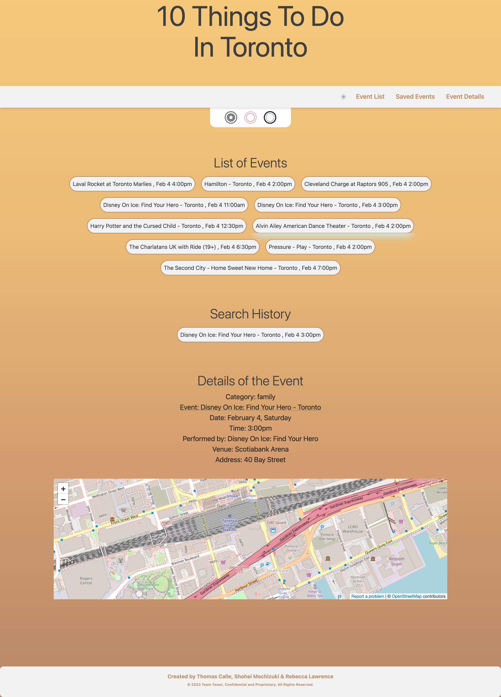

# 10-Things-To-Do-In-Toronto 

## Description

Team: 7even's Interactive Front-End Project

Greetings! the Interactive Front-End Project showecases group memebers: Rebecca Lawrence, Shohei Mochizuki & Thomas Calle's collaborative skills and talents to potential user audiences and employers. Employers want to see what you can do, so that's exactly what we'll give'um!

## Table of contents

- [Overview](#overview)
- [The challenge](#the-challenge)
- [Screenshot](#screenshot)
- [Links](#links)
- [Our process](#our-process)
- [Built with](#built-with)
- [What we learned](#what-we-learned)
- [Continued development](#continued-development)
- [Authors](#authors)
- [Acknowledgments](#acknowledgments)

## Overview

### The Challenge

Create an Interactive Front-End Project from scratch - showcases (10) local evenets throughout a weekend with the geographic location of: Toronto, Ontario, Canada. Accesabilioty features have been optmozied for those visiually impared, providing; bright soft tones, high contrast for colour blindnes and dark mode feture to go easier on the eyes. The layout will incorporate minimal, yet organized and sufficent data making it clear and cut to those regardless of the nature of their work and experience time line. In this case Thomas Calle(me) is a aspiring Full Stack Developer, the goal is to develope a portfolio web page to the highest degree for employers and recruiters.

### Screenshot:

### Links

- Solution URL: [Solution URL](https://thomascalle.github.io/10-Things-To-Do-In-Toronto/)

## Our Process

Initialized and configured a GitHub Repository with GitHub Project integration to maintain version control for best practice project. Workflow established through daily meeting, outlined Kanban board tracking and specified goals and accomplishments. Minimum Viable Product (MVP) was the focused approach on delivery - start minimal, then add the details later. Agile software development principles lead our main focus on USER STORY and ACCESSABILITY development based on the Agile Manifesto twelve principles.

### Built with
- Deployed GitHub Pages
- HTML Markup
- Dynamic JavaScript
- CSS Framework: [ TailwindCSS](https://v2.tailwindcss.com/docs), [Flowbite](https://flowbite.com/docs/getting-started/quickstart/)
- Server-Side API: [ SeatGeek](https://platform.seatgeek.com/), [ OpenStreetMap](https://www.openstreetmap.org/about)
- Client-Side Storag(Persistent DATA)
- Accessible User Interface(UI) & Experience(UX)
- Polished and Clean Wireframing
- Mobile & Desktop 'ready display'
- Minimum Viable Product (MVP)
- Images: Sourced Locally (resources below)

### What We Learned

Our team has learned the necessity to create responsive web development, with accessible User Interface(UI) & Experience(UX) for the (visually impaired). Implementing the use of Service-Side API's to compliment the use of data presented among a HTML & CSS dynamic through framework and style. Thus, creating easy access to the overall user experience with the versatile desktop and mobile application use.

Grasping the importance of professional formated HTML, CSS & JavaScript architecture has taught us the necessity to provide minimal, coherent and organized documentation. The project helped us to adapt to real world demands providing adequate resources, tracked progression logs, source revision and overall team flow through the following methodologies:

- Agile Manifesto
- Kanban Board
- Minimum Viable Product (MVP)

### Challenges Encountered:
- GitHub: members Shohei and Mochizuki could not push to origin main - causation: deletion of file name "Assets" created in GitHub by Thomas on local file
#### Shohei Mochizuki:
- Server-Side API drawback: outdated services, feature locked behind pay-wall, limited data/experience, and compatibility issues causing slow rendering.
- GitHub Workflow: instilling communication with team members was imperative, to ensure functionality among merge operations and overall branch control.
#### Rebecca Lawrence:
- CSS framework: learning implementation of varying frameworks along with open-source libraries.
- Documentation: sourcing practice guides in order to trial-run code to fully understand use within compatibility.
- Scope and Nature: pre-set framework components are challenging to alter, especially when meeting the groups overall vision wihtin a short deadline. 
- Retrospect: potential opportunity to use alternative CSS frameworks for code compatability.
#### Thomas Calle: 
- Accessibility: learned to commune accessibility developement and implementation as a priority, presetting the blue-print for colour blind accesability; deuteranomaly, protanopia, tritanopia, overall vision damage.
- Syncronizing and providing adequate resources, ensuring data has been logged and processed among the Kanban Board, while maintaining Minimum Viable Product (MVP) vision while delivering focus on the Agile Manifesto logged data to ensure members receive addequate resourcs among current goals and outlines.

## Continued Development

Throughout our great journey, our team has created the need to become professional Full Stack Developers. We'll continue to build upon our concrete foundation, innovation, intuitiveness and obsessions - advancing ourselves in the pursuit of recently developed projects.

Grasping the importance of professional team work flow, brought out the best 
Future development of the project along with other key fetures would be 
- Add a function of selecting multiple weekends
- Add a function of selecting a different city other than Toronto
- Add a function of selecting an event category
- Add a function of showing directions in the map section

## Authors

- Scrum and Architecture Lead:[ Thomas Calle](https://github.com/ThomasCalle)
- JavaScript Lead:[ Shohei Mochizuki](https://github.com/shohei-mochizuki)
- HTML & CSS Design Lead:[ Rebecca Lawrence](https://github.com/rkml14)

## Acknowledgements
Thank you for viewing 10-Things-To-Do-in-Toronto. Over the past week, our team has shared some of our most memorable experiences togehter. It's been one heck of a ride! and we couldn't have done it without you! As we continue developing forward with our goals of becoming Full Stack Developer's nearring closer, our team remains inspired by you, our passionate community. 

We'll see you on the other side!

© 2023 Team 7even. Confidential and Proprietary. All Rights Reserved.
